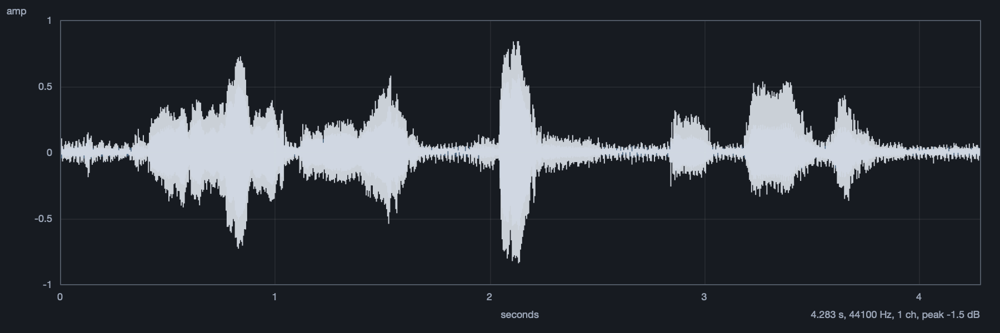
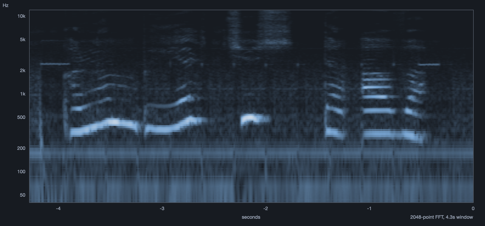
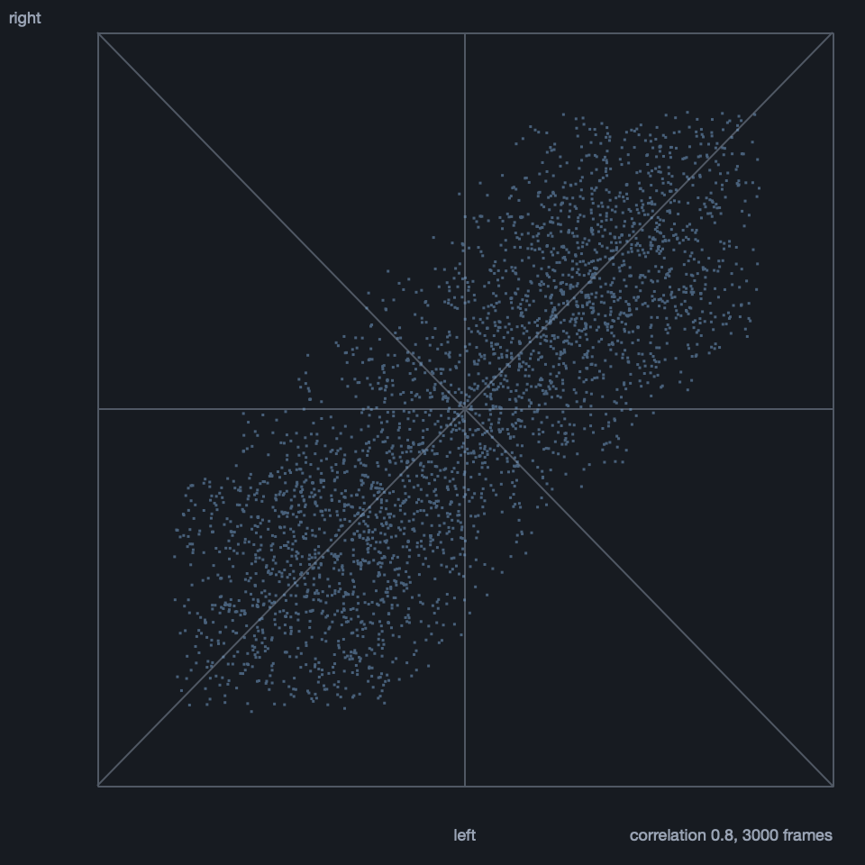
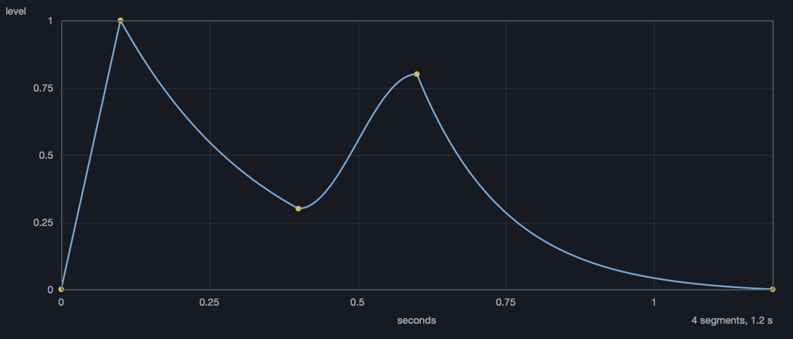
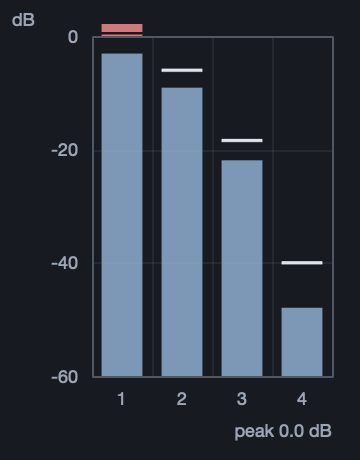
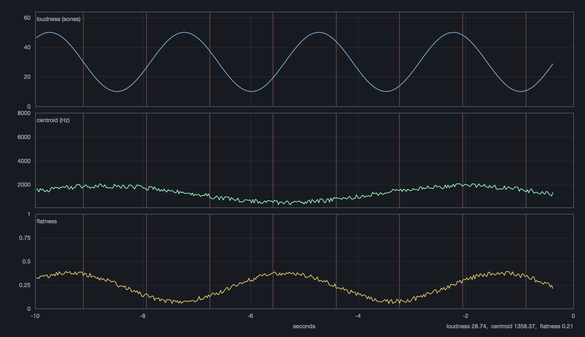
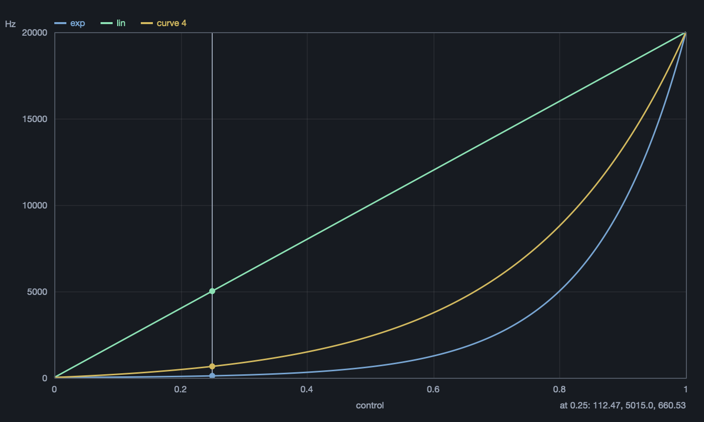

# PlotLib

Various plots for SuperCollider: bifurcation diagrams, phase portraits, histograms, event scatters, a level meter, a spectrum analyser, waveforms, spectrograms, a vectorscope, envelopes, descriptor tracks and mapping curves.


## Install

```supercollider
Quarks.install("https://github.com/bjarnig/PlotLib");
```

Developed against SuperCollider 3.14.

## Use

```supercollider
// period doubling into chaos, with a marker at one parameter value
PltBifurcation({ |x, r| r * x * (1 - x) }, 2.4, 4.0, 0.5).marker_(3.82).front;

// an attractor as a shape
PltPhase({ |x, y| [1 - (1.4 * x * x) + y, 0.3 * x] }, 0.1, 0.1, "Henon").front;

// what a distribution actually produces
PltHistogram({ exprand(0.01, 1.0) } ! 8000, 0, 1, 40, "exprand").front;

// what a pattern is actually playing
p = PltEvents("Pwhite", 8, 150, 1200).front;
q = p.watch(Pbind(\dur, Pwhite(0.08, 0.3), \freq, Pwhite(200, 900))).play;

// what the output bus is doing
PltMeter(2, 0).front;
PltSpectrum(0).front;
PltTrack.analysis(0).front;

// recorded sound
PltWave.fromSoundFile(path).front;
PltSpectrogram.fromSoundFile(path).logFreq_(true).front;
PltVector.live(0).front;
PltEnvelope(Env.perc(0.01, 0.4)).front;

// what a control does to a value
PltMap(\freq.asSpec).add(ControlSpec(20, 20000, \lin), "lin").marker_(0.25).front;
```

Reference in the help browser under **PlotLib**, more in [`examples/`](examples).

### Recorded sound

`PltWave` draws min and max per pixel column, so a whole file stays legible and no peak is lost. `PltSpectrogram` keeps the history `FreqScope` throws away, one `Image` column per frame.





`PltVector` is a vectorscope, `PltEnvelope` draws an `Env` as the shape it is.

<p>


</p>

### Live

`PltMeter` fills its bar in three zones, green below −12 dB, yellow to −3, red above, the peak line taking its zone's colour. `PltTrack` puts descriptors on one clock with onsets as ticks.

<p>


</p>



### Mapping

At a control value of 0.25, `\freq` gives 112 Hz where the linear equivalent gives 5015.



## Themes

`\darkBlue` (default), `\dark`, `\light`. Open plots change with the theme.

```supercollider
PlotLib.theme_(\light);
```

| | | |
|:-:|:-:|:-:|
|  |  |  |
| `\darkBlue` | `\dark` | `\light` |

## Notes

Computing is separate from drawing: the maths is a class method returning plain data, so `PltBifurcation.points(...)` needs no window and is testable headless. The live views take frames through `pushFrame`, so anything can drive them, and they re-register through `ServerTree` so cmd-period leaves no frozen display. Every plot has `alwaysOnTop`, `position_`, `writeImage`, and closes on escape.

```
sclang tests/test-compute.scd     # maps, distributions, ticks, FFT unpacking
sclang tests/test-events.scd      # event plotter, meter zones, window handling
sclang tests/test-live.scd        # meter, spectrum and analysis against known signals
sclang tests/check-docs.scd       # every help page parses and every example compiles
sclang tests/render-shots.scd     # regenerate these images
```

Run `test-live.scd` on its own: it takes the default server and the audio device, so a second sclang instance makes it fail as though the views were broken.

## Acknowledgements

The waveform family was prompted by the examples of Marinos Koutsomichalis, *Mapping and Visualization with SuperCollider* (Packt, 2013), in particular its approach of building a spectrogram by writing pixels into an `Image`. No code from it is used here.

GPL-3.0.
