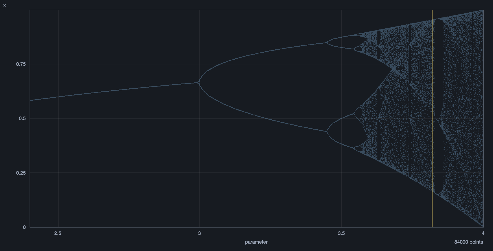
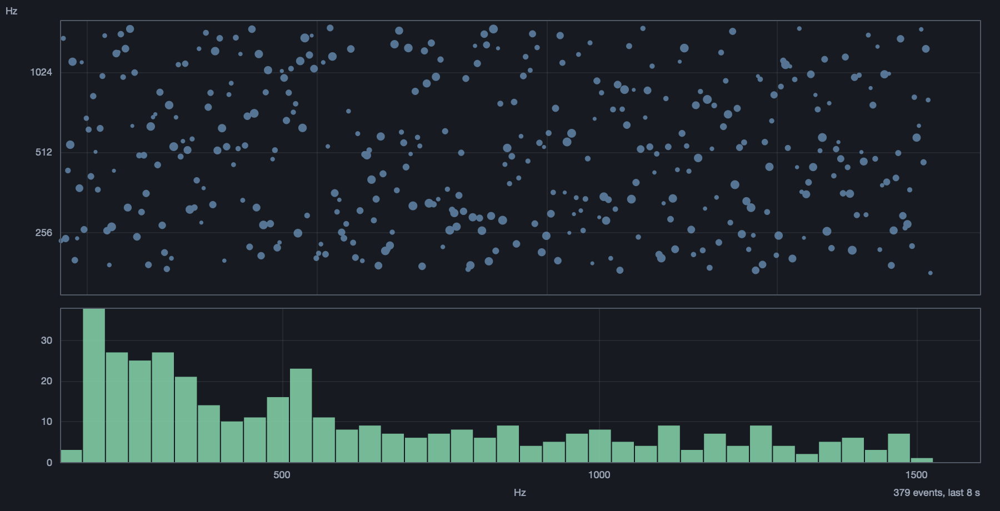
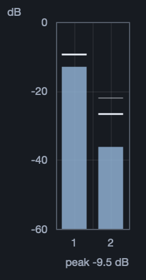
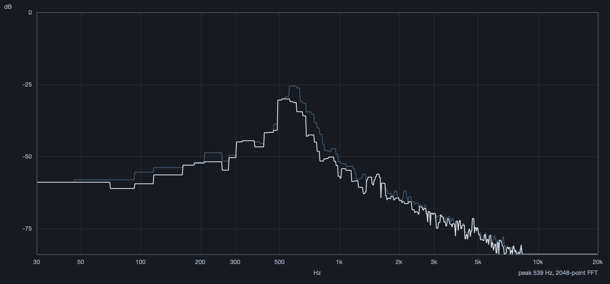
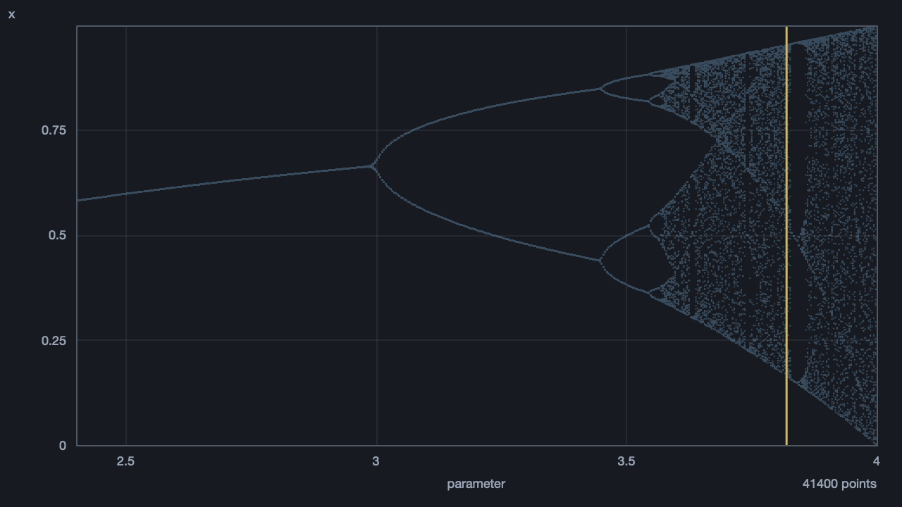
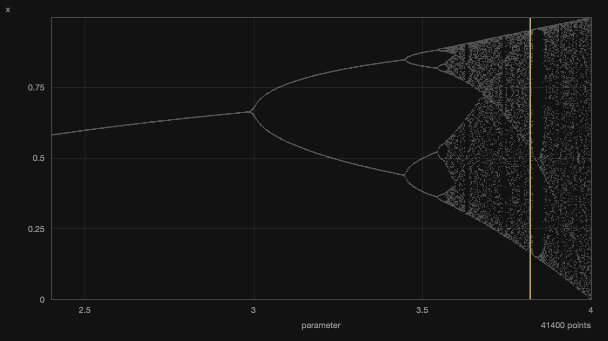
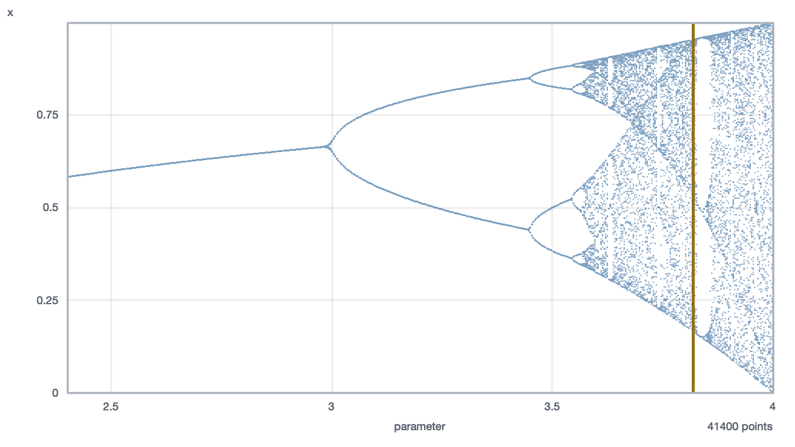

# PlotLib

Various plots for SuperCollider: bifurcation diagrams, phase portraits, histograms, a live event scatter, a level meter and a spectrum analyser.



## Install

```supercollider
Quarks.install("https://github.com/bjarnig/PlotLib");
```

Developed against SuperCollider 3.14.

## Use

```supercollider
// period doubling into chaos, with a marker at one parameter value
PltBifurcation({ |x, r| r * x * (1 - x) }, 2.4, 4.0, 0.5).marker_(3.82).front;

// an attractor as a shape
PltPhase({ |x, y| [1 - (1.4 * x * x) + y, 0.3 * x] }, 0.1, 0.1, "Henon").front;

// what a distribution actually produces
PltHistogram({ exprand(0.01, 1.0) } ! 8000, 0, 1, 40, "exprand").front;

// what a pattern is actually playing
p = PltEvents("Pwhite", 8, 150, 1200).front;
q = p.watch(Pbind(\dur, Pwhite(0.08, 0.3), \freq, Pwhite(200, 900))).play;

// what the output bus is doing
PltMeter(2, 0).front;
PltSpectrum(0).front;
```

`PltScatter` and `PltView` are below, and `PlotLib` holds the palette and the
pure helpers. Reference under **PlotLib**, with more in
[`examples/`](examples). 

### Events



### Meter and spectrum

<p>

</p>



`PltMeter` points at a bus, has a settable dB scale and update rate, holds peaks separately from the peak line, exposes `peaks` / `rmss` / `clipping` to code, and can be driven from the language with `pushFrame`. Both recover after cmd-period. See the help file for the full comparison.

## Themes

`\darkBlue` (default), `\dark`, `\light`. Open plots change with the theme.

```supercollider
PlotLib.theme_(\light);
```

| | | |
|:-:|:-:|:-:|
|  |  |  |
| `\darkBlue` | `\dark` | `\light` |

## Notes

Computing is separate from drawing: the maths is a class method returning plain data, so `PltBifurcation.points(...)` needs no window and can be tested headless. The live views take frames through `pushFrame`, so they can be driven from anything, not only from the server, and they re-register through `ServerTree` so cmd-period does not leave a frozen display behind.

Every plot has `alwaysOnTop`, `position_`, `writeImage`, and closes on escape.

```
sclang tests/test-compute.scd     # maps, distributions, ticks, FFT unpacking
sclang tests/test-events.scd      # the event plotter, including pitch resolution
sclang tests/test-live.scd        # meter and spectrum against known signals
sclang tests/check-docs.scd       # every documented example compiles
sclang tests/render-shots.scd     # regenerate these images
```

Run `test-live.scd` on its own: it takes the default server and the audio device, so a second sclang instance running at the same time makes it fail as though the views were broken.

GPL-3.0.
